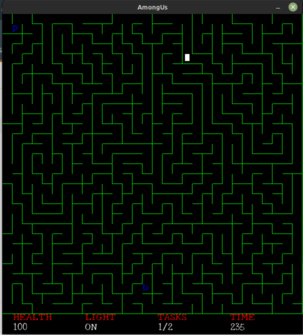

# Among Us



## Building

```bash
$ sudo apt-get update
$ sudo apt-get install libglu1-mesa-dev freeglut3-dev mesa-common-dev xorg-dev libglew-dev libglm-dev
$ sudo apt install cmake
$ mkdir build
$ cd build
$ cmake ..
$ make
```

### Running the Game

```
$ cd build
$ ./a
```

## Objective

This game’s objective is to exit a maze you have been dropped into after finishing two tasks. You must hurry
because reactor meltdowns do not fix themselves. To win the game you need to complete the tasks and reach the bottom right cell.

## Features

### 1. World:

A procedural maze (different maze layout on every game startup). Maze has a single exit located at the bottom right corner, and if the player reaches this point after completing two tasks, the player can exit the maze. The walls of the maze are visible as lines on the screen (2D).

### 2. Player:

A single-player with some assigned health value can navigate the generated maze with the key-
board.

### 3. HUD (Heads Up Display):

A box of rendered text on the top left of the screen, present at all times,
detailing the following:

- Health: This indicates the player’s points, which can increase or decrease based on events/interactions
  in a manner defined by you.
- Tasks: ’Tasks completed / Total number of tasks available.’
- Time: A countdown from some X number of seconds. When the clock runs out, end the game.

## Tasks

1. An imposter character (enemy) exists at a random location in the maze and begins to get to your position as soon as the game begins. A button (a `b` drawn in the maze path) to vaporise (make the imposter disappear) the imposter exists at another random location in the maze. The task here is to reach the button before the imposter reaches you. Use a pathfinding algorithm to make the imposter reach you as you move around. Coming in contact with the imposter ends the game.

2. A button (represented with `b`) to release power-ups and obstacles exists in a random part of the maze. The task is to reach the button and then collect the power-ups to increase your score. Power-ups are represented as `C`, while obstacles are represented as `O`. Coming in contact with an obstacle decreases your score.

## Controls

- Move Up : Up Arrow
- Move Down : Down Arrow
- Move Left : Left Arrow
- Move Right : Right Arrow
